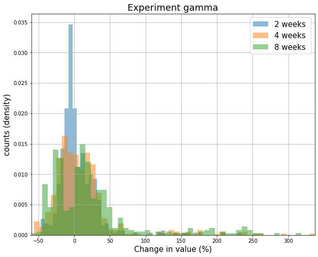
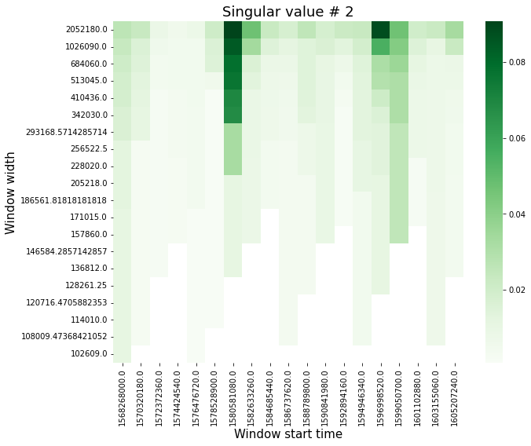

========
Overview
========

.. start-badges

.. list-table::
    :stub-columns: 1

    * - tests
      - | |requires|
        |
    * - package
      - | |version| |wheel| |supported-versions| |supported-implementations|
        | |commits-since|

.. |requires| image:: https://requires.io/github/mitchellpkt/python-isthmus/requirements.svg?branch=master
    :alt: Requirements Status
    :target: https://requires.io/github/mitchellpkt/python-isthmus/requirements/?branch=master

.. |version| image:: https://img.shields.io/pypi/v/isthmuslib.svg
    :alt: PyPI Package latest release
    :target: https://pypi.org/project/isthmuslib

.. |wheel| image:: https://img.shields.io/pypi/wheel/isthmuslib.svg
    :alt: PyPI Wheel
    :target: https://pypi.org/project/isthmuslib

.. |supported-versions| image:: https://img.shields.io/pypi/pyversions/isthmuslib.svg
    :alt: Supported versions
    :target: https://pypi.org/project/isthmuslib

.. |supported-implementations| image:: https://img.shields.io/pypi/implementation/isthmuslib.svg
    :alt: Supported implementations
    :target: https://pypi.org/project/isthmuslib

.. |commits-since| image:: https://img.shields.io/github/commits-since/mitchellpkt/python-isthmus/v0.0.4.svg
    :alt: Commits since latest release
    :target: https://github.com/mitchellpkt/python-isthmus/compare/v0.0.4...master

.. end-badges

Convenience utils for plotting, styling, and manipulating high-dimensional vectors.

* Analyses and plotting methods are one line to call, and produce consistently-formatted publication-ready plots.
* Enables rapid exploratory data analysis (EDA) and prototyping, perfect for taking a quick peek at data or making a quick figure to stash in the lab book (with labels and titles automatically included). See `examples here <https://github.com/Mitchellpkt/python-isthmuslib/blob/main/isthmuslib_tutorial.ipynb>`_.
* Designed for easy drop-in use for other projects, whether using internally to the code or for clean notebooks. Import isthmuslib to avoid writing many lines of plotting code when it would distract or detract from the main focus of your project.
* The visual and text configuration objects (:code:`Style` and :code:`Rosetta`, respectively) can be directly attached to a given data set, so you can "set it and forget it" at instantiation. All subsequent outputs will automatically have matching colors, sizes, labels, etc.
* The :code:`VectorSequence` object is designed for handling, plotting, and manipulating timeseries-like high-dimensional vectors. Its functionality includes: dimensionality reduction via singular vealue decomposition, seasonal (e.g. weekly, monthly, ...) timeseries decomposition, infosurface generation, and more.
* Uses industry standard libraries (pyplot, numpy, seaborn, pandas, etc) under the hood, and exposes their underlying functionality through the wrappers.

Free software for personal or academic use: **GNU Lesser General Public License v3 (LGPLv3).** Contact licensing@mitchellpkt.com for commercial applications.

Installation
============

::

    pip install isthmuslib

Documentation
=============

To use the project:

.. code-block:: python

    import isthmuslib

Demo one-liners
=============
A complete tutorial notebook is available here: https://github.com/Mitchellpkt/python-isthmuslib/blob/main/isthmuslib_tutorial.ipynb

Below are a few demos of one-line helper functions for plot generation and statistical analyses.

We can plot multiple distributions with the :code:`hist()` wrapper around :code:`matplotlib.pyplot`:

.. code-block:: python

    isthmuslib.hist([data_1, data_2],  bins=50, xlabel='Wavelength',
                    title='H2 observations', legend_strings=["Q3", "Q4"])

Additional keyword arguments are passed through to the pyplot histogram function, for example :code:`density` and :code:`cumulative`.

.. code-block:: python

    istmuslib.hist([data_1, data_2], bins=200, density=True, cumulative=True,
                   xlabel='Wavelength', title='H2 observations', legend_strings=["Q3", "Q4"])

Likewise, we have a wrapper for :code:`matplotlib`'s scatter,

.. code-block:: python

    isthmuslib.scatter([data_1, data_2], [data_3, data_4], xlabel='angle $\phi$', ylabel='voltage',
                       title='Tuning results', legend_strings=['Control case', 'Calibrated'])

We can also cast a single x & y vector pair into a 2D histogram (essentially a surface with height [color] showing bin counts).

.. code-block:: python

    isthmuslib.hist2d(data_1, data_3, bins=(20, 20), xlabel='angle $\phi$', ylabel='voltage',
                      title='Control case', colorbar_label='sample counts')

We can also load a dataframe or CSV file into the :code:`VectorSequence` class for working with multivariate timeseries and similarly shaped data with some physically-interpretable strictly ordered axis, for example:

+ Multiple physical features (temperature, pressure, and irradiation) measured simultaneously at 3 different heights
+ Multiple stock values observed over time
+ Fluorescence intensity measured simultaneously at different wavelengths

(If the data does not have an inherent ordering, use the isthmuslib :code:`VectorMultiSet` instead of the :code:`VectorSequence`).

.. code-block:: python

    timeseries: isthmuslib.VectorSequence().read_csv(pathlib.Path.cwd() / 'data' / 'example_vector_sequence_data.csv',
                    inplace=False, basis_col_name='timestamp', name_root='Experiment gamma')

The isthmuslib plotting features demoed above are directly attached to the vector multiset & sequence objects.

.. code-block:: python

    timeseries.plot('baz')
    timeseries.hist('bar', bins=50)

We can take a peek at correlation between the columns (wraps :code:`corr` from :code:`pandas`).

.. code-block:: python

    timeseries.correlation_matrix()

We can visualize seasonal decomposition analyses with a single line, wrapping :code:`statsmodel.tsa` logic with styled plots.

.. code-block:: python

    timeseries.plot_decomposition('foo', 30, figsize=(10, 6), title='Foo trace: ', ylabel='Voltage')

The VectorSequence timeseries class contains logic for sliding window analyses with arbitrary functions. Here we'll use a throwaway lambda :code:`appreciation` to demonstrate, and apply that function over sliding windows with 2, 4, and 8 week durations.

.. code-block:: python

    appreciation = lambda o: {'Change in value (%)': 100 * (o.values('foo')[-1] / o.values('foo')[0] - 1)}
    window_widths_weeks: List[float] = [2, 4, 8]
    result: isthmuslib.SlidingWindowResults = timeseries.sliding_window(appreciation,
                                                                  [x * 60 * 60 * 24 * 7 for x in window_widths_weeks],
                                                                  overlapping=True)

The :code:`SlidingWindowResult.plot_results()` method automatically plots results separated by window width.

.. code-block:: python

    result.plot_results('Change in value (%)', legend_override=[f"{x} weeks " for x in window_widths_weeks])

Likewise, the :code:`sliding_window.plot_pdfs()` method plots distributions separated by window width.

.. code-block:: python

    result.plot_pdfs('Change in value (%)', density=True, bins=50,
                     legend_override=[f"{x} weeks " for x in window_widths_weeks])

Dimensionality reduction (SVD) logic over sliding windows is built into the :code:`VectorSequence` class, allowing easy calculation and visualization of information surfaces (first 3 singular value surfaces shown below). The timeseries basis (specified in :code:`basis_col_name`) is automatically excluded from the SVD analysis. The :code:`cols` keyword argument can be specified when only certain data features should be taken into account.

.. code-block:: python

    timeseries.plot_info_surface()

.. image:: ./readme_images/svd1.png

This library includes log extraction tooling from mostly unstructured strings or files. For example, take the string: "It was the best of times, [@@@] it was the worst [<<x=5>>]of times, it was the age of wisdom, [<<y='foo'>>] it was the age of foolishness, [@@@] it was the epoch of belief, it was the epoch of incredulity, [<<y='bar'>>] it was the season of Light, it was the season of Darkness"

The one-liner:

.. code-block:: python

    isthmuslib.auto_extract_from_text(input_string)

extracts the dataframe:

.. image:: ./readme_images/df.png

We have some tools for quickly checking the quality of a data feature intended for use as a basis. Whether missing or unevenely-spaced data is OK or problematic is 100% context dependent.

First, let's look at some clean data with evenly spaced values and no missing data:

.. code-block:: python

    isthmuslib.basis_quality_plots(uniform_complete_data)

.. image:: ./readme_images/good1.png

On the other hand, here's what we see for uneven or missing data:

.. code-block:: python

    isthmuslib.basis_quality_plots(uneven_data)

